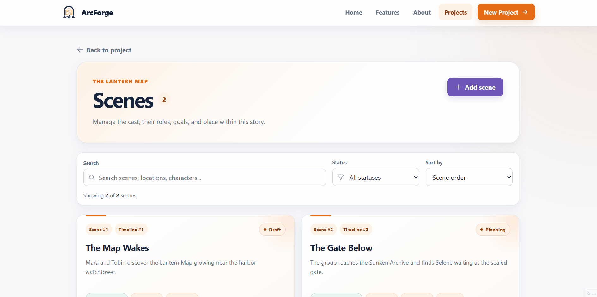
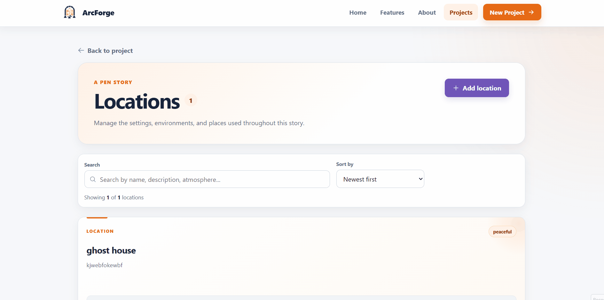
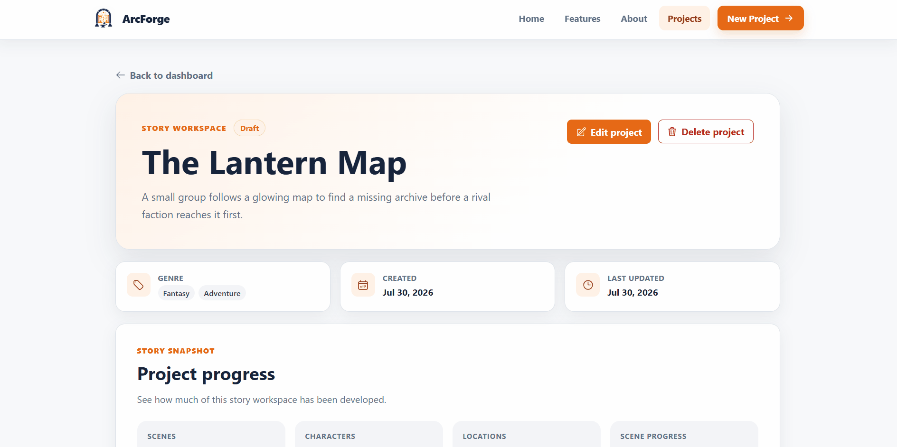
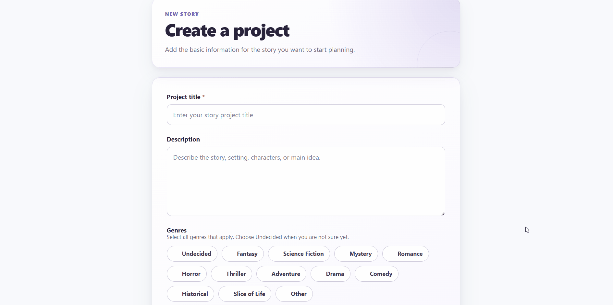
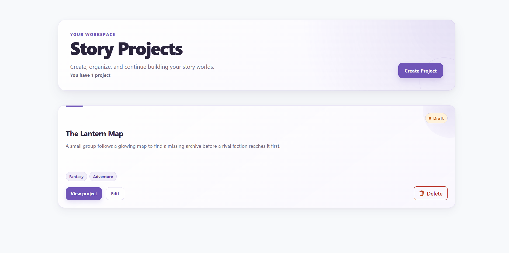
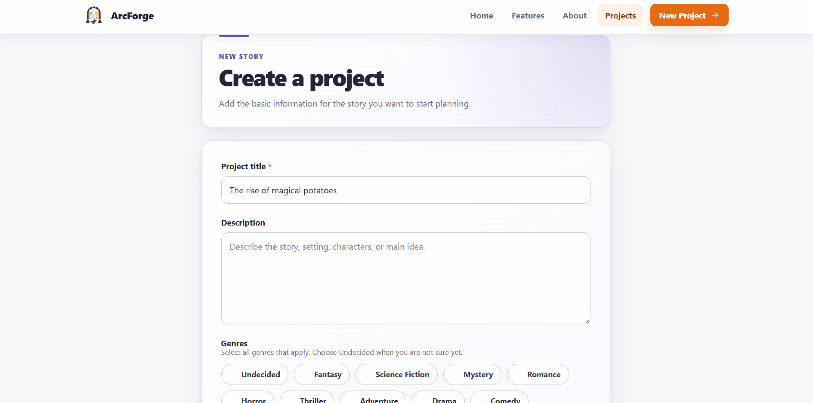
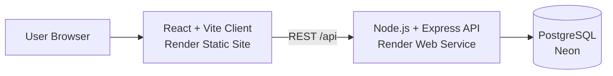

<div align="center">


# ArcForge

**A full-stack story planning workspace for organizing projects, scenes, characters, locations, and story progress.**

[Live Application](https://arcforge-client.onrender.com/) ·
[API](https://arcforge-api.onrender.com/) ·
[API Health](https://arcforge-api.onrender.com/api/health)

</div>

---

## Overview

ArcForge is a full-stack story planning application designed for writers, game designers, and other creators who need a structured way to organize complex story ideas.

Instead of keeping characters, scenes, locations, timelines, and notes across separate documents or spreadsheets, ArcForge brings them together inside project-based workspaces. Creators can build story projects, manage their scenes and characters, organize locations, track scene progress, and connect characters to the scenes in which they appear.

ArcForge was built as the final team project for **CodePath WEB103**.

> **Project status:** The course project has been completed, submitted, and demonstrated. Ongoing work focuses on post-course documentation, maintenance, and portfolio polish while preserving the functionality of the submitted application.

---

## Live Application

| Service    | Link                                                         |
| ---------- | ------------------------------------------------------------ |
| Web App    | [Launch ArcForge](https://arcforge-client.onrender.com/)     |
| REST API   | [ArcForge API](https://arcforge-api.onrender.com/)           |
| API Health | [Health Check](https://arcforge-api.onrender.com/api/health) |

> The deployed API may take a little longer to respond after a period of inactivity.

---

## Preview

### Project Dashboard

Create and organize multiple story projects from a central dashboard.


### Scene Planning

Create, edit, organize, search, filter, and sort scenes within each story project.


### Character Management

Build reusable character profiles and organize character information within a project.


Additional feature demonstrations are available in the [`gifs/`](./gifs) directory.

---

## Features

### Story Project Management

Users can create, view, edit, and delete story projects.

Each project can include:

- Title
- Description
- Multiple genres
- Project status
- Scenes
- Characters
- Locations

The project dashboard provides a central place for managing multiple stories.

---

### Scene Management

Scenes are organized within individual story projects and support full create, read, update, and delete workflows.

Scene information includes:

- Name
- Description
- Scene order
- Timeline order
- Notes
- Location
- Characters
- Status

This allows creators to organize both the presentation order of scenes and their chronological position within the story.

---

### Scene Search, Filtering, and Sorting

The scene library includes tools for navigating larger projects.

Users can:

- Search scene names
- Search descriptions
- Search locations
- Search character names
- Filter scenes by status
- Sort by scene order
- Sort by timeline order
- Sort alphabetically
- Sort by newest



---

### Character Profiles

Characters belong to individual story projects and can be created, viewed, edited, and deleted.

Character profiles can include:

- Name
- Story role
- Description
- Goal
- Knowledge notes

This keeps important character information connected to the story project rather than scattered across separate notes.

---

### Location Library

Each project includes its own reusable location library.

Locations can include:

- Name
- Description
- Atmosphere

Users can create, edit, view, and delete locations as their story world develops.



---

### Scene-Character Assignments

Characters can be assigned to specific scenes through a many-to-many relationship.

Assignments can track additional information such as:

- A character's role in the scene
- Knowledge gained during the scene

This provides more context than simply listing which characters appear.

---

### Story Progress Overview

ArcForge summarizes project activity and scene progress so creators can quickly understand the current state of a story project.



---

### Dynamic Project-Scoped Navigation

ArcForge uses React Router to organize project resources through dynamic routes.

Examples include:

```text
/projects/:projectId
/projects/:projectId/edit

/projects/:projectId/scenes
/projects/:projectId/scenes/new
/projects/:projectId/scenes/:sceneId
/projects/:projectId/scenes/:sceneId/edit

/projects/:projectId/characters
/projects/:projectId/characters/new
/projects/:projectId/characters/:characterId
/projects/:projectId/characters/:characterId/edit

/projects/:projectId/locations
/projects/:projectId/locations/new
/projects/:projectId/locations/:locationId
/projects/:projectId/locations/:locationId/edit
```

Keeping resources scoped to a project makes it easier to navigate between related story information.

---

### Form Validation

Forms validate required information before submitting data to the API.

Users receive clear feedback when submitted information is missing or invalid.



---

### Confirmation Modals

Destructive actions such as deleting projects, scenes, characters, or locations require confirmation to reduce accidental data loss.



---

### Notifications

ArcForge displays success and error notifications after important actions such as:

- Creating records
- Updating records
- Deleting records
- Handling failed API requests


---

### Loading and Submission States

The application provides loading indicators while retrieving data and disables relevant controls while requests are being submitted.

This helps prevent duplicate submissions and gives users feedback while asynchronous operations are running.



---

### Responsive Interface

ArcForge includes responsive navigation and layouts designed to keep the application usable across desktop and smaller screen sizes.

The application also includes shared UI patterns for:

- Loading states
- Error states
- Empty states
- Not-found states
- Notifications
- Forms
- Detail pages
- Collection pages

---

## Tech Stack

| Layer           | Technologies                                          |
| --------------- | ----------------------------------------------------- |
| Frontend        | React 19, React Router, Vite 7, JavaScript, HTML, CSS |
| UI              | Heroicons, reusable React components                  |
| Backend         | Node.js, Express.js                                   |
| API             | REST                                                  |
| Database        | PostgreSQL, `pg`                                      |
| Configuration   | dotenv, CORS                                          |
| Deployment      | Render, Neon                                          |
| CI/CD           | GitHub Actions                                        |
| Code Quality    | ESLint                                                |
| Version Control | Git, GitHub                                           |

---

## Architecture



ArcForge separates the application into three primary layers:

1. **React client** — renders the user interface and handles browser-side navigation.
2. **Express API** — handles application requests and database operations.
3. **PostgreSQL database** — stores projects and their related story data.

---

## Application Data

### Currently Exposed Through the Application

| Entity             | Purpose                             |
| ------------------ | ----------------------------------- |
| `story_projects`   | Stores top-level story projects     |
| `scenes`           | Stores scenes belonging to projects |
| `characters`       | Stores project character profiles   |
| `locations`        | Stores project locations            |
| `scene_characters` | Connects characters to scenes       |

### Schema Foundations for Future Features

The database schema also contains foundations for additional story-planning functionality:

| Entity                    | Planned Use                            |
| ------------------------- | -------------------------------------- |
| `items`                   | Important objects or story items       |
| `scene_items`             | Connect items to scenes                |
| `character_relationships` | Track relationships between characters |

These database structures are present in the schema, but their complete application workflows are part of the future roadmap.

See [`server/data/schema.sql`](./server/data/schema.sql) for the current database definition.

---

## API Overview

The Express backend exposes project-scoped REST resources under `/api`.

### Health

```text
GET /api/health
```

### Projects

```text
/api/projects
```

### Scenes

```text
/api/projects/:projectId/scenes
```

### Characters

```text
/api/projects/:projectId/characters
```

### Locations

```text
/api/projects/:projectId/locations
```

### Scene-Character Assignments

```text
/api/projects/:projectId/scenes/:sceneId/scene-characters
```

The client communicates with these endpoints through shared API service utilities.

---

## Local Installation

### Prerequisites

Before running ArcForge locally, install:

- [Node.js](https://nodejs.org/) 20.19+ or another version compatible with Vite 7
- npm
- PostgreSQL or access to a hosted PostgreSQL database
- Git

---

### 1. Clone the Repository

```bash
git clone https://github.com/arcforge-scenecraft/arcforge.git
cd arcforge
```

---

### 2. Install Dependencies

```bash
npm install
```

All project dependencies are managed from the root `package.json`.

---

### 3. Create Your Environment File

Copy the included example configuration:

#### macOS / Linux

```bash
cp .env.example .env
```

#### Windows PowerShell

```powershell
Copy-Item .env.example .env
```

Then update `.env` with your PostgreSQL configuration.

Example local configuration:

```env
NODE_ENV=development
PORT=3001

VITE_API_BASE_URL=http://localhost:3001
CLIENT_URL=http://localhost:5173

PGUSER=your_postgres_user
PGPASSWORD=your_postgres_password
PGHOST=localhost
PGPORT=5432
PGDATABASE=arcforge

DB_SSL=false
```

For a hosted PostgreSQL database that requires SSL:

```env
DB_SSL=true
```

> Never commit your real `.env` file. Database credentials and other secrets should remain private.

See [`.env.example`](./.env.example) for the complete environment variable reference.

---

### 4. Initialize the Database

ArcForge includes a reset script that creates the database tables and loads sample story data.

```bash
npm run reset
```

> **Warning:** `npm run reset` drops the ArcForge tables in the configured database before recreating and seeding them. Do not run this command against a database containing data you need to preserve.

---

### 5. Start the Development Environment

```bash
npm run dev
```

This starts both:

- Vite frontend
- Express backend

Open the application at:

```text
http://localhost:5173
```

The API runs at:

```text
http://localhost:3001
```

The local health endpoint is:

```text
http://localhost:3001/api/health
```

---

## Available Scripts

| Command         | Description                                        |
| --------------- | -------------------------------------------------- |
| `npm run dev`   | Starts the Vite client and Express server together |
| `npm run start` | Starts the Express server                          |
| `npm run build` | Builds the production Vite client                  |
| `npm run lint`  | Runs ESLint across the project                     |
| `npm run reset` | Drops, recreates, and seeds the database           |

Before submitting changes, run:

```bash
npm run lint
npm run build
```

---

## Continuous Integration

ArcForge uses **GitHub Actions** for continuous integration.

The CI workflow runs on:

- Pull requests targeting `main`
- Pushes to `main`

The workflow:

1. Checks out the repository
2. Uses Node.js 22
3. Installs dependencies with `npm ci`
4. Runs ESLint
5. Runs tests when a test script is available
6. Builds the production client

The workflow configuration is available at:

[`/.github/workflows/ci.yml`](./.github/workflows/ci.yml)

---

## Deployment

ArcForge is deployed using separate frontend, backend, and database services.

### Frontend

**Render Static Site**

Hosts the React/Vite production build.

### Backend

**Render Web Service**

Runs the Node.js and Express REST API.

### Database

**Neon PostgreSQL**

Provides the persistent PostgreSQL database used by the deployed API.

Production environment variables configure the client API URL, CORS origin, database connection, and SSL behavior.

---

## Project Structure

```text
arcforge/
├── .github/
│   └── workflows/
│       └── ci.yml
│
├── client/
│   ├── public/
│   └── src/
│       ├── components/
│       ├── hooks/
│       ├── pages/
│       ├── services/
│       └── styles/
│
├── gifs/
│
├── milestones/
│
├── planning/
│   ├── wireframes/
│   ├── entity_relationship_diagram.md
│   ├── user_stories.md
│   └── wireframes.md
│
├── server/
│   ├── config/
│   ├── controllers/
│   ├── data/
│   ├── routes/
│   └── server.js
│
├── .env.example
├── eslint.config.js
├── package.json
└── README.md
```

---

## Project Documentation

Additional planning and development documentation is available in the repository.

- [User Stories](./planning/user_stories.md)
- [Entity Relationship Diagram](./planning/entity_relationship_diagram.md)
- [Wireframes](./planning/wireframes.md)
- [Milestone Documentation](./milestones)

These documents capture both the original planning process and the evolution of the application during development.

---

## Future Roadmap

The submitted version of ArcForge establishes the core story-planning workflow. Future development could expand the platform with additional creator and collaboration features.

### Authentication and Roles

Add user authentication and authorization so projects can belong to specific users and support different access levels.

Potential roles include:

- Project owner
- Collaborator
- Viewer

---

### Project Workspace Navigation

Add persistent project-level navigation so creators can quickly move between:

- Overview
- Scenes
- Characters
- Locations
- Items

without returning to the project detail page between sections.

---

### Image Uploads

Allow creators to attach reference images to:

- Projects
- Characters
- Scenes
- Locations

This would make ArcForge more useful for visual storytelling, game design, comics, and film planning.

---

### Story Item Management

Build the frontend and API workflows for the existing `items` and `scene_items` database structures.

Creators could track important objects, props, weapons, clues, or other story elements and identify the scenes in which they appear.

---

### Character Relationships

Expose the existing `character_relationships` schema through the API and user interface.

This could allow creators to visualize relationships such as:

- Family
- Allies
- Rivals
- Mentors
- Romantic relationships
- Other custom connections

---

### Project Templates

Allow users to start projects from predefined structures based on story type or creative workflow.

Examples could include:

- Novel
- Screenplay
- Short film
- Visual novel
- Story-driven game

---

### Expanded Automated Testing

Increase automated coverage across:

- API endpoints
- Form validation
- Data normalization
- CRUD workflows
- Navigation
- Shared UI components

---

## Team

ArcForge was designed and developed by a six-person team for CodePath WEB103.

| Team Member                                       | Focus and Contributions                                                                                                                                                                                                                      |
| ------------------------------------------------- | -------------------------------------------------------------------------------------------------------------------------------------------------------------------------------------------------------------------------------------------- |
| [Jingyi He](https://github.com/jing2003)          | **Project integration and delivery** — Led project coordination and final integration; built project workflows, shared UI and styling patterns, deployment and CI, production API fixes, responsive navigation, and application-wide polish. |
| [Bingying Li](https://github.com/bing-ying-li)    | **Locations and character API** — Built the location library and location detail experience, implemented the character REST API, and introduced reusable overview components for project and location pages.                                 |
| [Adeline Greene](https://github.com/AdelineG218)  | **Scene management** — Expanded the scene model and API and built scene creation, editing, detail, library, and deletion workflows for structured story planning.                                                                            |
| [Abdelrahman Mohamed](https://github.com/fukubie) | **Shared UI and API foundations** — Created reusable loading, error, empty, and not-found states; added the shared API request utility; and implemented backend scene creation, update, and deletion routes.                                 |
| [Allen Ramirez](https://github.com/drizzyallen)   | **Database and backend structure** — Built reset and seed tooling, early API read routes, location REST routes, project-scoped scene routes, route/controller separation, and scene-character relationship support.                          |
| [Salman Khan](https://github.com/salman-khan03)   | **Character management** — Built character creation and editing forms and added character deletion support to complete the character management workflow.                                                                                    |

---

## Course

ArcForge was created as the final capstone project for **CodePath WEB103**.

The project provided hands-on experience with:

- Full-stack web development
- REST API design
- Relational database modeling
- React component architecture
- Responsive interface development
- Production deployment
- Continuous integration
- Git and GitHub collaboration
- Pull request workflows
- Code review
- Debugging across local and production environments

---

<div align="center">

**Built with React, Express, and PostgreSQL.**

[Launch ArcForge](https://arcforge-client.onrender.com/) ·
[View Repository](https://github.com/arcforge-scenecraft/arcforge)

</div>
