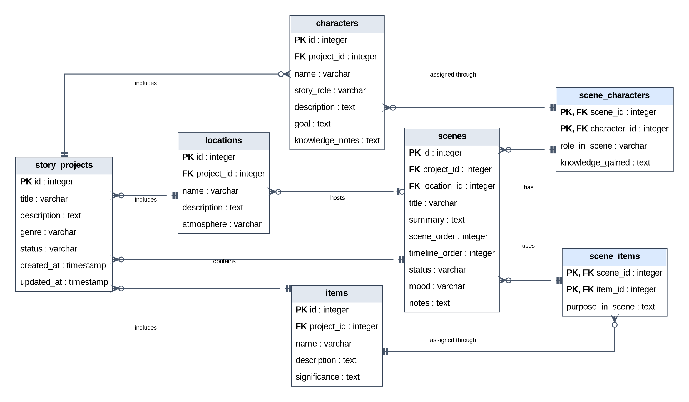
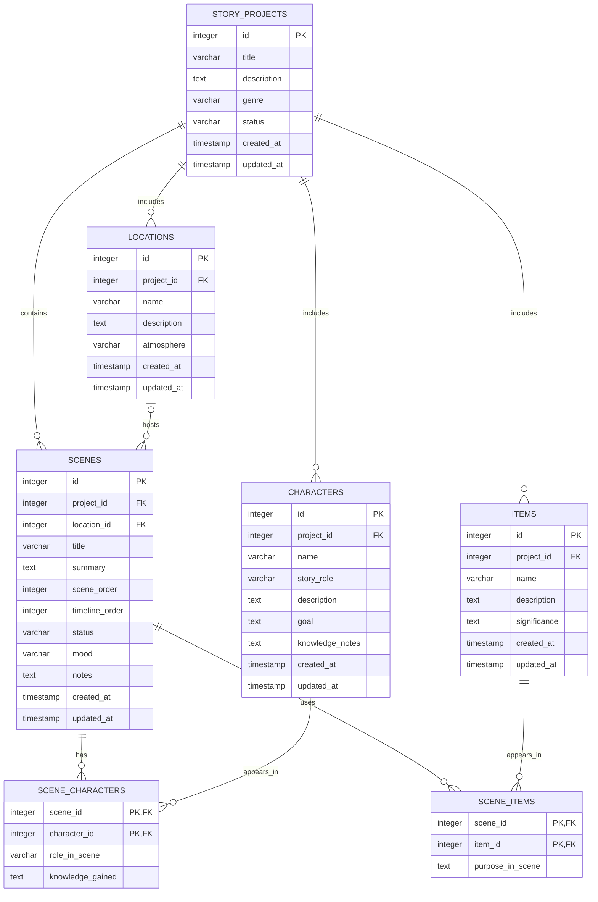

# Entity Relationship Diagram

This database supports ArcForge's story-planning workspace. A story project contains its own scenes, characters, locations, and story items. Scenes can include multiple characters and items through join tables.

## Create the List of Tables

- **story_projects** — stores the main information for each story project.
- **scenes** — stores scenes that belong to a story project and may take place at a location.
- **characters** — stores character profiles for a story project.
- **locations** — stores reusable story locations for a story project.
- **items** — stores important props or story items for a story project.
- **scene_characters** — join table connecting scenes and characters, including each character's role in a scene.
- **scene_items** — join table connecting scenes and items, including an item's purpose in a scene.

## Add the Entity Relationship Diagram

### Editable Mermaid Version

## Relationship Summary

- One **story project** can have many scenes, characters, locations, and items.
- One **location** can be used by many scenes, while a scene can have zero or one location.
- **Scenes** and **characters** have a many-to-many relationship through `scene_characters`.
- **Scenes** and **items** have a many-to-many relationship through `scene_items`.
- The composite primary keys in the join tables prevent the same character or item from being assigned to the same scene more than once.
