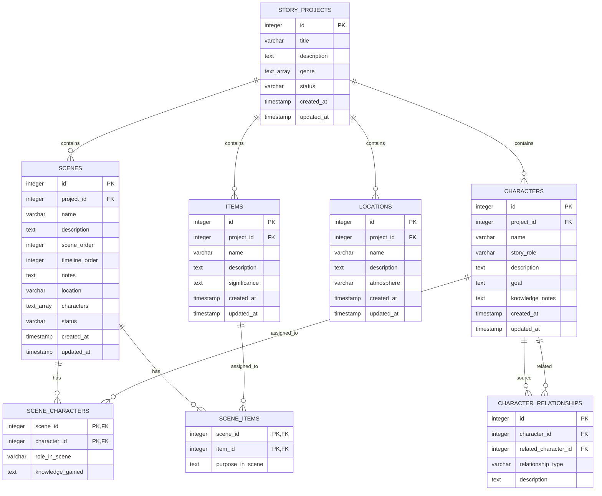
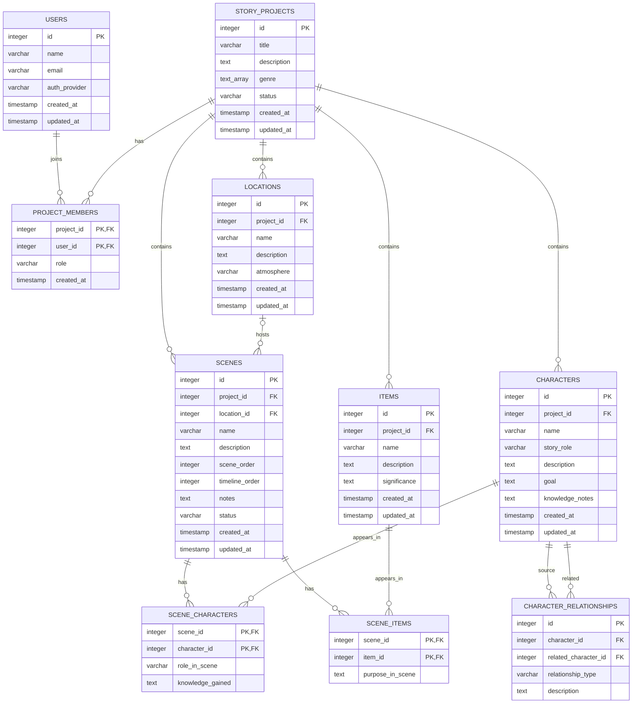

# Entity Relationship Diagram

This document describes the current ArcForge PostgreSQL database schema and outlines a possible future data model as the application expands.

The **current schema** section reflects the tables and columns defined in [`server/data/schema.sql`](../server/data/schema.sql).

The **future architecture** section is conceptual only. It represents possible improvements and should not be interpreted as functionality that is currently implemented.

---

# Current Database Schema

ArcForge organizes story-planning data around a central `story_projects` table.

Each story project can contain:

- Scenes
- Characters
- Locations
- Story items

Additional relationship tables support:

- Characters assigned to scenes
- Items assigned to scenes
- Relationships between characters

---

## Current Entity Relationship Diagram


```mermaid
erDiagram
    STORY_PROJECTS ||--o{ SCENES : contains
    STORY_PROJECTS ||--o{ CHARACTERS : contains
    STORY_PROJECTS ||--o{ LOCATIONS : contains
    STORY_PROJECTS ||--o{ ITEMS : contains

    SCENES ||--o{ SCENE_CHARACTERS : has
    CHARACTERS ||--o{ SCENE_CHARACTERS : assigned_to

    SCENES ||--o{ SCENE_ITEMS : has
    ITEMS ||--o{ SCENE_ITEMS : assigned_to

    CHARACTERS ||--o{ CHARACTER_RELATIONSHIPS : source
    CHARACTERS ||--o{ CHARACTER_RELATIONSHIPS : related

    STORY_PROJECTS {
        integer id PK
        varchar title
        text description
        text_array genre
        varchar status
        timestamp created_at
        timestamp updated_at
    }

    LOCATIONS {
        integer id PK
        integer project_id FK
        varchar name
        text description
        varchar atmosphere
        timestamp created_at
        timestamp updated_at
    }

    CHARACTERS {
        integer id PK
        integer project_id FK
        varchar name
        varchar story_role
        text description
        text goal
        text knowledge_notes
        timestamp created_at
        timestamp updated_at
    }

    SCENES {
        integer id PK
        integer project_id FK
        varchar name
        text description
        integer scene_order
        integer timeline_order
        text notes
        varchar location
        text_array characters
        varchar status
        timestamp created_at
        timestamp updated_at
    }

    ITEMS {
        integer id PK
        integer project_id FK
        varchar name
        text description
        text significance
        timestamp created_at
        timestamp updated_at
    }

    SCENE_CHARACTERS {
        integer scene_id PK, FK
        integer character_id PK, FK
        varchar role_in_scene
        text knowledge_gained
    }

    SCENE_ITEMS {
        integer scene_id PK, FK
        integer item_id PK, FK
        text purpose_in_scene
    }

    CHARACTER_RELATIONSHIPS {
        integer id PK
        integer character_id FK
        integer related_character_id FK
        varchar relationship_type
        text description
    }
```

> `text_array` in the diagram represents PostgreSQL `TEXT[]`.

---

# Table Reference

## `story_projects`

Stores the top-level story projects created in ArcForge.

| Column        | Type           | Description                |
| ------------- | -------------- | -------------------------- |
| `id`          | `SERIAL`       | Primary key                |
| `title`       | `VARCHAR(255)` | Project title              |
| `description` | `TEXT`         | Project description        |
| `genre`       | `TEXT[]`       | One or more project genres |
| `status`      | `VARCHAR(50)`  | Current project status     |
| `created_at`  | `TIMESTAMP`    | Creation timestamp         |
| `updated_at`  | `TIMESTAMP`    | Last update timestamp      |

A story project acts as the parent resource for scenes, characters, locations, and items.

---

## `locations`

Stores reusable locations belonging to a story project.

| Column        | Type           | Description                        |
| ------------- | -------------- | ---------------------------------- |
| `id`          | `SERIAL`       | Primary key                        |
| `project_id`  | `INTEGER`      | References `story_projects.id`     |
| `name`        | `VARCHAR(255)` | Location name                      |
| `description` | `TEXT`         | Description of the location        |
| `atmosphere`  | `VARCHAR(255)` | Mood or atmosphere of the location |
| `created_at`  | `TIMESTAMP`    | Creation timestamp                 |
| `updated_at`  | `TIMESTAMP`    | Last update timestamp              |

Deleting a story project automatically deletes its associated locations through `ON DELETE CASCADE`.

---

## `characters`

Stores character profiles belonging to a story project.

| Column            | Type           | Description                           |
| ----------------- | -------------- | ------------------------------------- |
| `id`              | `SERIAL`       | Primary key                           |
| `project_id`      | `INTEGER`      | References `story_projects.id`        |
| `name`            | `VARCHAR(255)` | Character name                        |
| `story_role`      | `VARCHAR(100)` | Character's role in the overall story |
| `description`     | `TEXT`         | Character description                 |
| `goal`            | `TEXT`         | Character goal or motivation          |
| `knowledge_notes` | `TEXT`         | Notes about what the character knows  |
| `created_at`      | `TIMESTAMP`    | Creation timestamp                    |
| `updated_at`      | `TIMESTAMP`    | Last update timestamp                 |

Deleting a story project automatically deletes its associated characters.

---

## `scenes`

Stores scenes belonging to a story project.

| Column           | Type           | Description                                       |
| ---------------- | -------------- | ------------------------------------------------- |
| `id`             | `SERIAL`       | Primary key                                       |
| `project_id`     | `INTEGER`      | References `story_projects.id`                    |
| `name`           | `VARCHAR(255)` | Scene name                                        |
| `description`    | `TEXT`         | Scene description                                 |
| `scene_order`    | `INTEGER`      | Order in which the audience experiences the scene |
| `timeline_order` | `INTEGER`      | Chronological position within the story           |
| `notes`          | `TEXT`         | Additional planning notes                         |
| `location`       | `VARCHAR(255)` | Location name stored with the scene               |
| `characters`     | `TEXT[]`       | Character names associated with the scene         |
| `status`         | `VARCHAR(50)`  | Scene planning status                             |
| `created_at`     | `TIMESTAMP`    | Creation timestamp                                |
| `updated_at`     | `TIMESTAMP`    | Last update timestamp                             |

Current supported statuses include:

- `Planning`
- `In Progress`
- `On Hold`
- `Completed`

### Scene Ordering

ArcForge stores two different ordering values because presentation order and chronological order are not always the same.

**Scene order** represents where the scene appears in the story presented to the audience.

**Timeline order** represents when the event occurs chronologically inside the story world.

For example, a flashback might appear as scene 8 while representing timeline event 2.

---

## `scene_characters`

Connects characters and scenes through a many-to-many relationship.

| Column             | Type           | Description                                                  |
| ------------------ | -------------- | ------------------------------------------------------------ |
| `scene_id`         | `INTEGER`      | References `scenes.id`                                       |
| `character_id`     | `INTEGER`      | References `characters.id`                                   |
| `role_in_scene`    | `VARCHAR(100)` | Optional description of the character's purpose in the scene |
| `knowledge_gained` | `TEXT`         | Optional information learned during the scene                |

The combination of:

```text
scene_id + character_id
```

forms the composite primary key.

This prevents the same character from being assigned to the same scene more than once.

The backend includes API support for managing these assignments. The current user interface does not yet expose the full `role_in_scene` and `knowledge_gained` workflow.

---

## `items`

Stores important objects belonging to a story project.

| Column         | Type           | Description                       |
| -------------- | -------------- | --------------------------------- |
| `id`           | `SERIAL`       | Primary key                       |
| `project_id`   | `INTEGER`      | References `story_projects.id`    |
| `name`         | `VARCHAR(255)` | Item name                         |
| `description`  | `TEXT`         | Item description                  |
| `significance` | `TEXT`         | Why the item matters to the story |
| `created_at`   | `TIMESTAMP`    | Creation timestamp                |
| `updated_at`   | `TIMESTAMP`    | Last update timestamp             |

The database schema includes item support, but complete item-management UI and API workflows remain future work.

---

## `scene_items`

Connects scenes and story items through a many-to-many relationship.

| Column             | Type      | Description                           |
| ------------------ | --------- | ------------------------------------- |
| `scene_id`         | `INTEGER` | References `scenes.id`                |
| `item_id`          | `INTEGER` | References `items.id`                 |
| `purpose_in_scene` | `TEXT`    | Describes how or why the item appears |

The combination of:

```text
scene_id + item_id
```

forms the composite primary key.

This prevents the same item from being assigned to the same scene more than once.

The database structure exists, while the complete application workflow remains part of the future roadmap.

---

## `character_relationships`

Stores relationships between two characters.

| Column                 | Type           | Description                   |
| ---------------------- | -------------- | ----------------------------- |
| `id`                   | `SERIAL`       | Primary key                   |
| `character_id`         | `INTEGER`      | Source character              |
| `related_character_id` | `INTEGER`      | Related character             |
| `relationship_type`    | `VARCHAR(100)` | Type of relationship          |
| `description`          | `TEXT`         | Optional relationship details |

The schema prevents a character from being related to itself:

```sql
CHECK (character_id <> related_character_id)
```

It also prevents duplicate relationship records with the same:

```text
character_id
+ related_character_id
+ relationship_type
```

Potential relationship types could include:

- Family
- Friend
- Ally
- Rival
- Mentor
- Enemy
- Romantic relationship
- Custom relationship

The database structure exists, but the corresponding frontend and API workflow remains future work.

---

# Relationship Summary

## Story Projects

One `story_projects` record can contain many:

- `scenes`
- `characters`
- `locations`
- `items`

These child records reference the project using `project_id`.

The foreign keys use `ON DELETE CASCADE`, meaning deleting a project also removes its associated story data.

---

## Scenes and Characters

Scenes and characters have a many-to-many relationship through:

```text
scene_characters
```

A scene can contain multiple characters, and a character can appear in multiple scenes.

The relationship can also store scene-specific metadata such as:

- The character's role in the scene
- Knowledge gained during the scene

---

## Scenes and Items

Scenes and items have a many-to-many relationship through:

```text
scene_items
```

A scene can contain multiple important items, and an item can appear across multiple scenes.

---

## Character Relationships

Characters have a self-referencing relationship through:

```text
character_relationships
```

Each record connects one character to another character.

This provides the database foundation for a future relationship-management feature.

---

# Current Implementation Notes

The current database reflects the evolution of ArcForge during the WEB103 capstone.

Some data is currently represented in both simple scene fields and more relational structures.

For example:

```text
scenes.location
```

stores the selected location as text, rather than using a `location_id` foreign key.

Similarly:

```text
scenes.characters
```

stores character names in a PostgreSQL `TEXT[]`, while the database also contains the normalized:

```text
scene_characters
```

join table.

These approaches allowed the submitted application to support its current story-planning workflows while leaving relational structures available for more advanced functionality.

For the portfolio release, the existing schema is preserved to avoid introducing unnecessary post-submission regressions.

A future version could normalize these relationships further.

---

# Feature Status by Data Model

| Data Model                           | Database | Backend/API | Current UI |
| ------------------------------------ | :------: | :---------: | :--------: |
| Story projects                       |    ✅    |     ✅      |     ✅     |
| Scenes                               |    ✅    |     ✅      |     ✅     |
| Characters                           |    ✅    |     ✅      |     ✅     |
| Locations                            |    ✅    |     ✅      |     ✅     |
| Scene-character assignments          |    ✅    |     ✅      |     🟡     |
| Scene-specific character roles       |    ✅    |     ✅      |     ❌     |
| Character knowledge gained per scene |    ✅    |     ✅      |     ❌     |
| Story items                          |    ✅    |     ❌      |     ❌     |
| Scene-item assignments               |    ✅    |     ❌      |     ❌     |
| Character relationships              |    ✅    |     ❌      |     ❌     |
| User accounts                        |    ❌    |     ❌      |     ❌     |
| Project collaborators / roles        |    ❌    |     ❌      |     ❌     |

**Legend**

- ✅ Implemented
- 🟡 Partially exposed
- ❌ Not currently implemented

---

# Future Data Model

A future version of ArcForge could normalize the existing story relationships and add authentication and collaboration.

The diagram below is a **conceptual roadmap**, not the current production database.


```mermaid
erDiagram
    USERS ||--o{ PROJECT_MEMBERS : joins
    STORY_PROJECTS ||--o{ PROJECT_MEMBERS : has

    STORY_PROJECTS ||--o{ SCENES : contains
    STORY_PROJECTS ||--o{ CHARACTERS : contains
    STORY_PROJECTS ||--o{ LOCATIONS : contains
    STORY_PROJECTS ||--o{ ITEMS : contains

    LOCATIONS o|--o{ SCENES : hosts

    SCENES ||--o{ SCENE_CHARACTERS : has
    CHARACTERS ||--o{ SCENE_CHARACTERS : appears_in

    SCENES ||--o{ SCENE_ITEMS : has
    ITEMS ||--o{ SCENE_ITEMS : appears_in

    CHARACTERS ||--o{ CHARACTER_RELATIONSHIPS : source
    CHARACTERS ||--o{ CHARACTER_RELATIONSHIPS : related

    USERS {
        integer id PK
        varchar name
        varchar email
        varchar auth_provider
        timestamp created_at
        timestamp updated_at
    }

    PROJECT_MEMBERS {
        integer project_id PK, FK
        integer user_id PK, FK
        varchar role
        timestamp created_at
    }

    STORY_PROJECTS {
        integer id PK
        varchar title
        text description
        text_array genre
        varchar status
        timestamp created_at
        timestamp updated_at
    }

    LOCATIONS {
        integer id PK
        integer project_id FK
        varchar name
        text description
        varchar atmosphere
        timestamp created_at
        timestamp updated_at
    }

    CHARACTERS {
        integer id PK
        integer project_id FK
        varchar name
        varchar story_role
        text description
        text goal
        text knowledge_notes
        timestamp created_at
        timestamp updated_at
    }

    SCENES {
        integer id PK
        integer project_id FK
        integer location_id FK
        varchar name
        text description
        integer scene_order
        integer timeline_order
        text notes
        varchar status
        timestamp created_at
        timestamp updated_at
    }

    ITEMS {
        integer id PK
        integer project_id FK
        varchar name
        text description
        text significance
        timestamp created_at
        timestamp updated_at
    }

    SCENE_CHARACTERS {
        integer scene_id PK, FK
        integer character_id PK, FK
        varchar role_in_scene
        text knowledge_gained
    }

    SCENE_ITEMS {
        integer scene_id PK, FK
        integer item_id PK, FK
        text purpose_in_scene
    }

    CHARACTER_RELATIONSHIPS {
        integer id PK
        integer character_id FK
        integer related_character_id FK
        varchar relationship_type
        text description
    }
```

---

# Potential Future Improvements

## Normalize Scene Locations

Replace:

```text
scenes.location
```

with:

```text
scenes.location_id
```

referencing:

```text
locations.id
```

This would prevent a location name stored in a scene from becoming inconsistent if the location is renamed.

---

## Normalize Scene Characters

Remove the denormalized:

```text
scenes.characters
```

array and use:

```text
scene_characters
```

as the single source of truth for scene-character assignments.

This would make it easier to support:

- Character IDs instead of names
- Character renaming
- Scene-specific roles
- Knowledge tracking
- More advanced character filtering

---

## Authentication and Project Membership

Future authentication could introduce:

```text
users
project_members
```

This would allow projects to support roles such as:

- Owner
- Collaborator
- Viewer

A many-to-many `project_members` table would allow one user to participate in multiple projects and one project to have multiple users.

---

## Media Attachments

Future image-upload functionality could introduce a media or attachment model associated with:

- Projects
- Characters
- Scenes
- Locations

This could support:

- Character reference images
- Concept art
- Location references
- Maps
- Storyboards

The final implementation would depend on the selected storage provider and media requirements.

---

# Source of Truth

The actual database definition is maintained in:

[`server/data/schema.sql`](../server/data/schema.sql)

When the database changes, this document should be updated alongside the schema so that the ERD continues to reflect the application accurately.
